# MoodleFlaskAPI
Python Flask API designed to specifically pull attendance information from Moodle. Built on the Attendance plugin.
## Instructions For Usage
First you need to download the attendance plugin here if you do not already have it: https://moodle.org/plugins/mod_attendance
Ensure that you have moodle running on your server and upload the downloaded attendance plugin on the page. You can get there from the Site Administration> Plugins> Install plugin. It takes you to a page where you upload the mod_attendance zipped file downloaded from link above. 
You might need to upgrade your moodle to the latest version for the plugin to work well incase you have incompatibility issues.

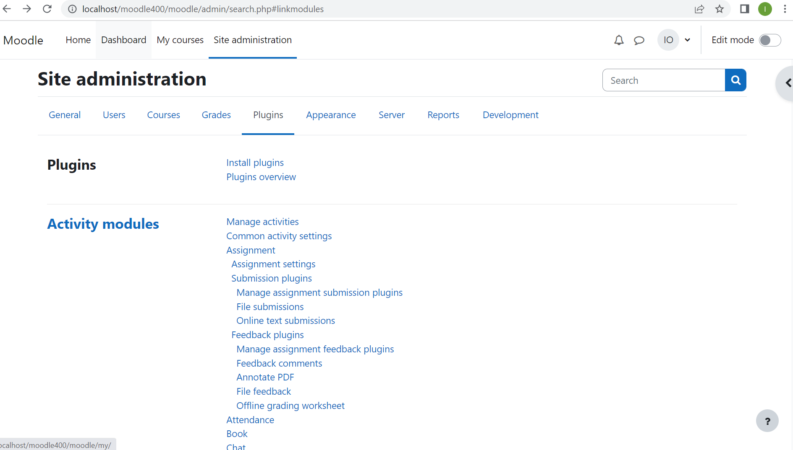

After the plugin has been installed successfully, you should be able to see attendance activity showing up now when you are in edit mode and want to add an activity as shown below: 

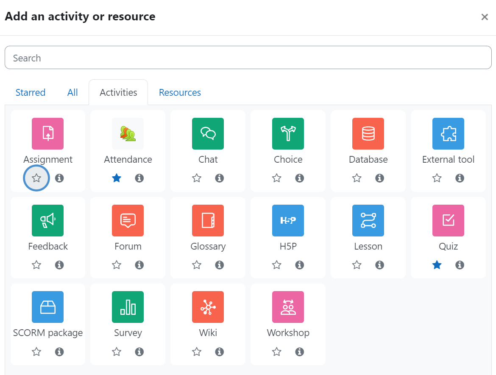

Once you have added the attendance component, you need to set up the moodle for external services so that you can access data from moodle through an API. It is important to note how many activities that are on your course page, so you can tell the index of the new grade information coming from the installed attendance module. In my case for test purposes I have 4 quiz items and the attendance module made it 5. So in my iteration as regards pulling specifically the attendance info, index use was [5] as can be seen in the moodle_api.py code which will be used for building a Flask API to pull that information specifically.
This is the navigation to the page where you can set up external services following the steps:
Site Administration> Server > Scroll down to Web Services > Overview

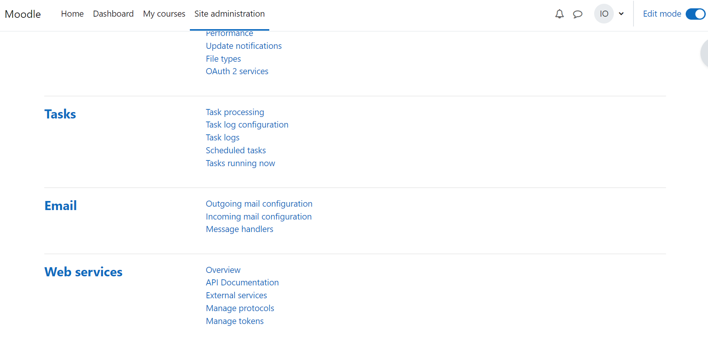

Ensure you go through all the steps in overview as shown and assign the basic functions of "core_webservice_get_site_info" and "gradereport_user_get_grade_items" are enabled as shown. The "core_webservice_get_site_info" functiomn is just to test that we can successfully pull out information from Moodle before we begin building Flask API on that. 

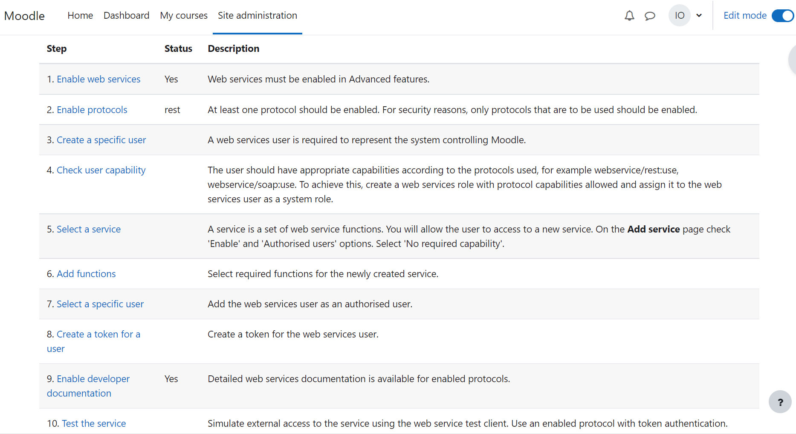

These following are the necessary functions before proceeding.

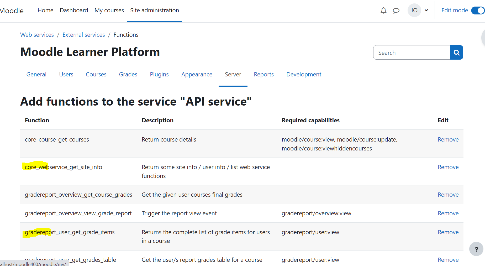

The last step would be to test the service to ensure we are getting information out without errors using the generated tokens. Remember to select authorization method as token when testing, also select the "core_webservice_get_site_info" under function as shown. Then test. 

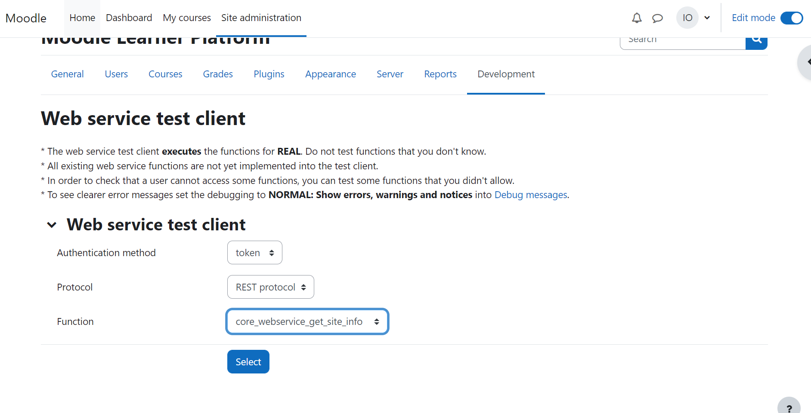

If Moodle gives an output that looks like this, then all is good to go for the next steps, else you need to repeat all of the Steps in Web Services > Overview and ensure you have the right permissions, so you can move forward with building the Flask API. A successful output from moodle after test should look like this, your token is sensitive info, that is why I have cleared it in black on the output:

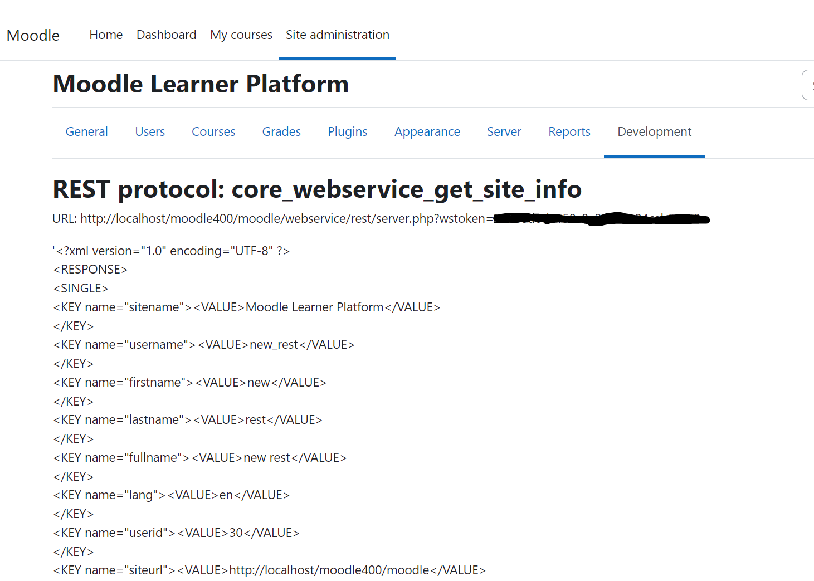

## API Building with Python

Now that we have ascertained that we can connect externally to moodle and pull out information, we can now proceed with API building. For these, you can download the files in the repository within a specific folder for your testing. Having PostMan API installed is also helpful in testing out the API although you can just use a web browser.
I use VS_studio editor, but any code editor that supports python and has terminal access will work as well. I have python installed on my system based on Anaconda, but if you already have Python installed, you just point your code editor to the python terminal.  You can install anaconda here:  https://www.anaconda.com/products/distribution which comes with latest version of Python. 

If you are using VSCode and have conda installed, Press "Ctrl+Shift+P" , search for “Python: Select Interpreter" as shown to select an interpreter and select your python conda version.

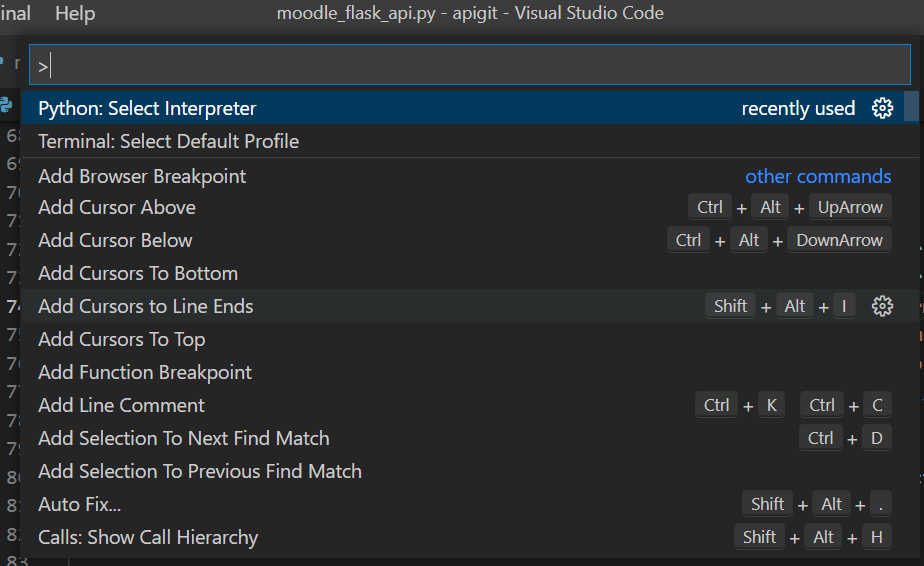

 if the option for your python conda version does not appear, click on "Enter Interpreter path" as shown:
 
 
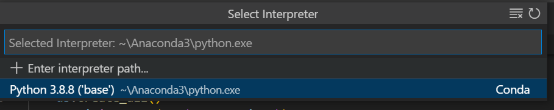

before you do this, you need to confirm where your conda python is saved by opening the Anaconda Prompt (This is available to you once you already installed Anaconda) and use the code "where python" as shown below:

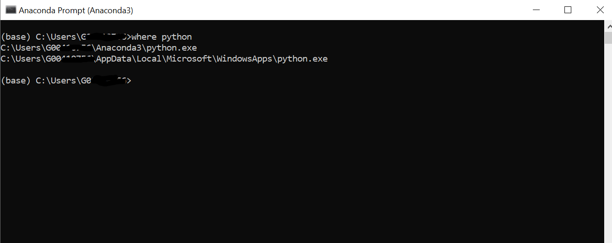

Copy any of the python locations and add it to the “Enter interpreter path” as above. Now you have the VsCode terminal setup for running the Python Flask API.
So open a new terminal from the Terminal tab of your code editor, Unzip the files if downloaded from here or just copy in the files “moodle_api.py” and “moodle_flask_api.py” and  into any folder of your choice. Navigate to the file location using “cd FILEPATH” . Once you are in the correct folder in the terminal, use the command “python -m venv .venv” to create a new virtual environment, then run “activate” to get the virtual environment activated. Run “pip3 install flask” followed by “pip3 install flask-sqlalchemy” Run pip freeze>requirements.txt to generate a text file of all requirements for the Flask app. And install any missing ones using pip install. 
## Code Sections explained
The following explains codes in the moodle_flask_api.py file which contains the Flask app. The other file moodle_api.py just allows for python easy connect to Moodle using the token for REST services. Documentation on it can be found here: https://github.com/mrcinv/moodle_api.py. 

Snippet of the first 46 code lines for the moodle_flask_api shown below:

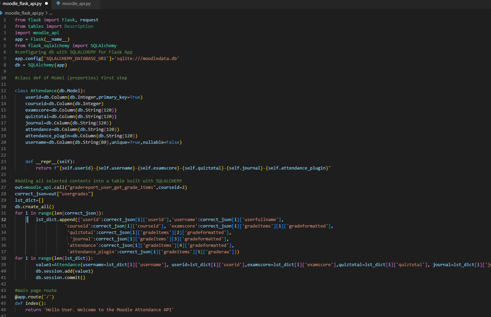

First few lines of code 1-8 deal with imports needed for the API, defines the Flask App and a initiates a database using the Flask app to store separately data from Moodle. 
Lines 10-20 define the class properties of the data that should be in db. Depending on the number of grade activities and content on your Moodle course page, this may need to be modified to suit. The userid, courseid and the userfullname always some with the out with moodle output.  It also defines the class properties of data that would be in the db initialized. 
Lines 26-41, calls all items from the grader report which includes the attendance information and stores all of them to the SQLALCHEMY database.
Lines 43-46 is the first display from the API which would just return the string “Hello user, welcome to the attendance api” or any other thing you would like to return on first page once API is run

Snippet of remaining code sections shown below:

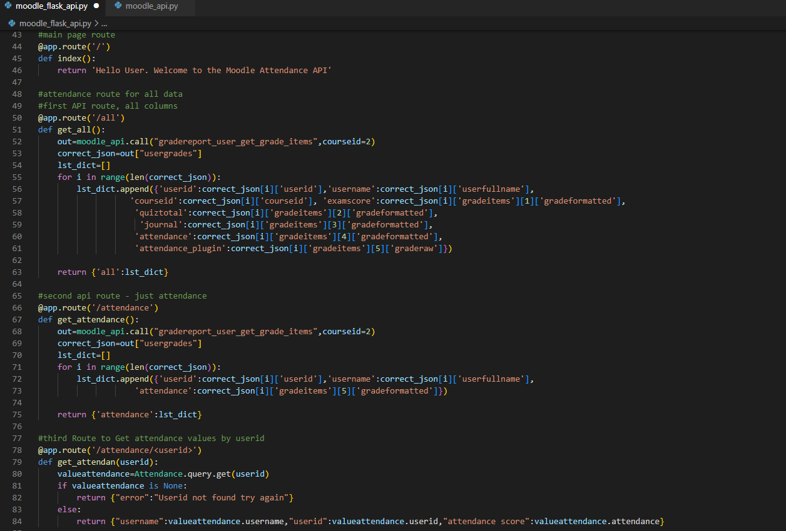

Lines 48-63 is API route that returns all of the items needed in the db from the moodle grader report function.  Note that the numbers [1],[2],[3],[4],[5] represent the positions of graded activities on your moodle page.
Lines 65-75 return just attendance information for all data in db with userid and username each.
Lines 77-84 covers code for the route to return attendance information for specific student using their student user id as parameter.
Explain key url etc change in moodle_api and change in indexes if more courses.

## Before Running Python Flask API

You need to change the parameter here in other file moodle_api.py for REST Services to match with your generated token from moodle and your server address for moodle. Replace the KEY(token), URL and ENDPOINT values with your own values. as in the sections in the code below:

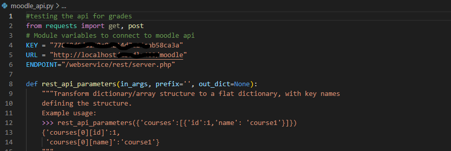

Then save before Running the API. 
The KEY is the same as the generated token which you used for testing in the moodle Overview. The URL and ENDPOINT can be found on the output page after you tested with token in Moodle as shown:

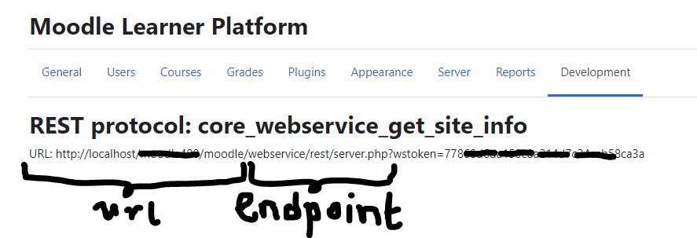

## Running the API
1.	Open Terminal 
2.	Type in command “SET FLASK_APP=moodle_flask_api.py” without quotation marks to specify Python Flask python file to run various API routes
3.	Run the command: flask run
Once you run the command and all goes well, you should see a notification like this in terminal:

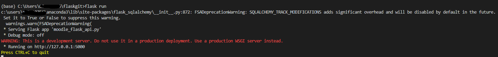

## Testing with PostMan

PostMan is great for testing APIs and can be freely downloaded here: https://www.postman.com/downloads/
To test the Flask API with postman enter the “running on” address (http://127.0.0.1:5000 displayed on terminal into a tab in the GET request bar as below and hit “Send”:

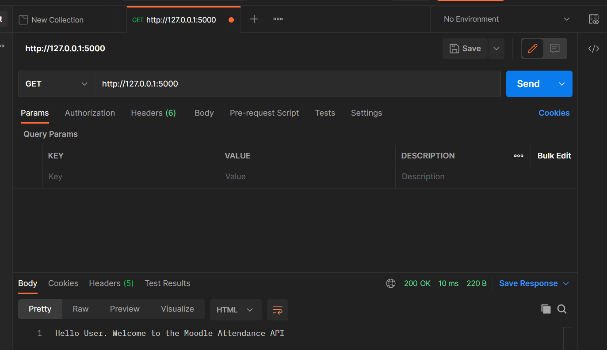

This opens the default route that just displays the String passed in the code section

To get all information in the API db displayed, pass the http://127.0.0.1:5000/all into the bar , the /all calls the first api route as defined by the @app.route() and displays json output of all information as shown:

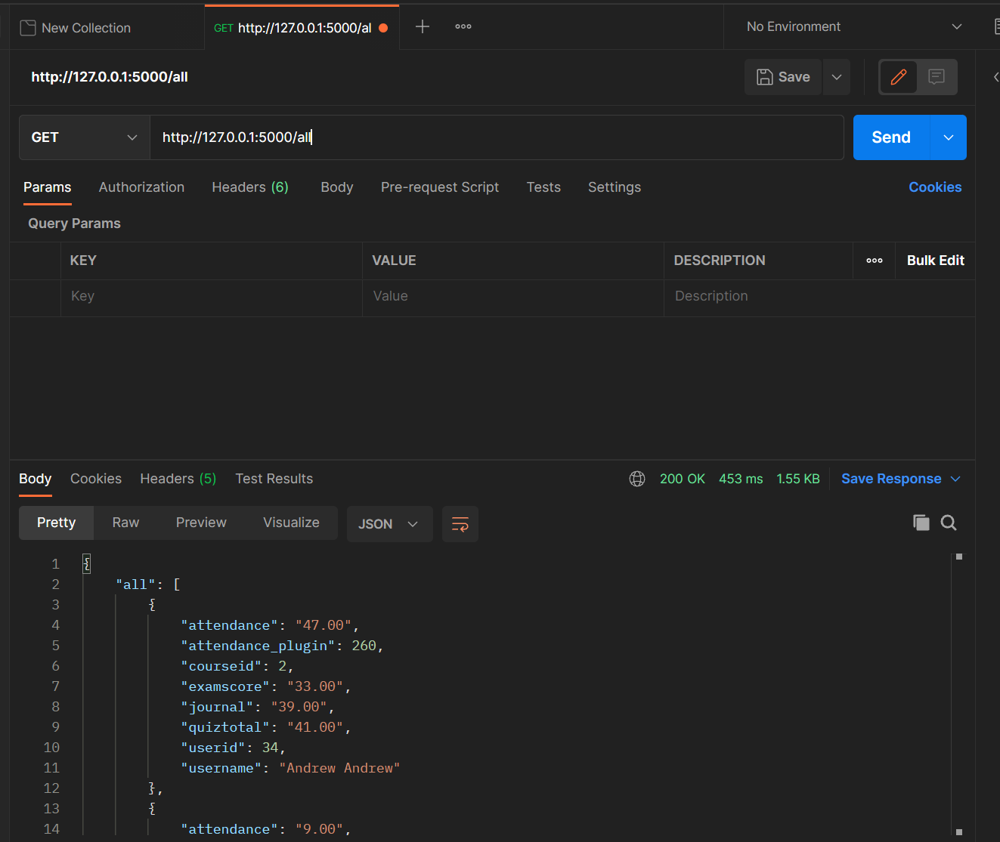

To serve only attendance information we pass through the attendance route by entering  http://127.0.0.1/attendance as shown and it gives an output of all the students in the course with just attendance information as shown:

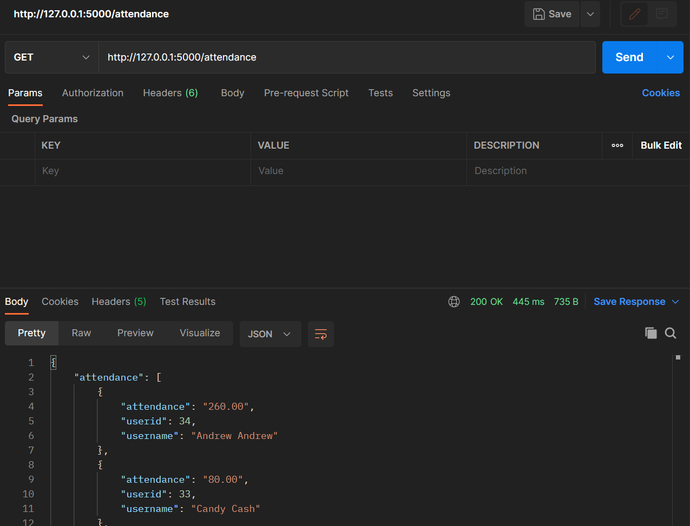

To get attendance Value for a specific user knowing their user id we use the API route http://127.0.0.1/attendance/{user_id} for example getting specific attendance score of a user with id of 33 would go into Postman as http://127.0.0.1/attandance/33 and return result like this:

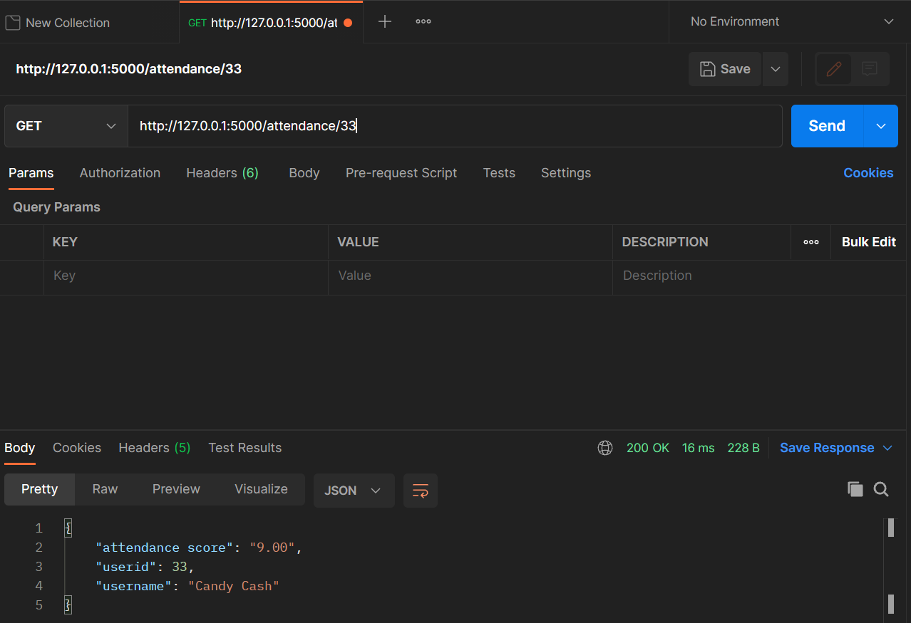

Thank you.

